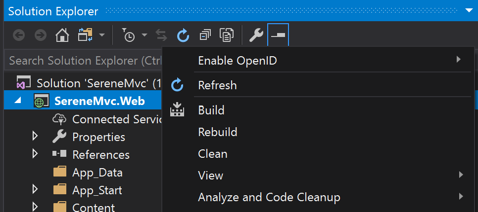

# OpenID for Serenity
Serenity is an application template for developing business apps in Visual Studio. 
The default application template stores user accounts and passwords in a database. 
This add-in enables OpenID user authentication across an organization, for 
business users who use a single sign-on with Office 365, Amazaon, Google, Okta, 
and Office365 or some other OpenID provider.

## Getting Started
 
1. Add the Visual Studio OpenID Extension  
__Extensions -> Manage Extensions -> Online -> Serenity.OpenID__

2. Right on the Serene web project __Enable OpenID__
  

3. Select the provider(s) you want to enable. You will need to obtain a client id and client secret from your provider. Links below
   
    | Provider |  Developer Account | Get Client ID/Secret 
    |--|--|--|
    | Microsoft | [Office 365 Signup] | [Developer Portal]
    | Amazon | [Amazon Signup] | [AWS Management]
    | Okta | [Okta Signup] | [Okta Management]
    | Google | [Google Signup] | [Google Management]
    | Github | [Github Signup]  | [Github Management]
    | LinkedIn | [LinkedIn Signup] | [LinkedIn Management]
    |--|--|--|
    | All Others  | __[Certified Providers]__||

4.  Update OpenID settings in your web.config

[Github Signup]:https://console.developers.google.com/apis/credentials/oauthclien
[Github Management]:https://console.developers.google.com/apis/credentials/oauthclien

[LinkedIn Signup]:https://console.developers.google.com/apis/credentials/oauthclien
[LinkedIn Management]:https://console.developers.google.com/apis/credentials/oauthclien

[Google Signup]:https://console.developers.google.com/apis/credentials/oauthclien
[Google Management]:https://console.developers.google.com/apis/credentials/oauthclien
[Visual Studio Market Place]: https://marketplace.visualstudio.com/_apis/public/gallery/publishers/VolkanCeylan/vsextensions/SereneSerenityApplicationTemplate/3.9.6.1/vspackage
[Okta Signup]: https://developer.okta.com/signup/
[Okta Management]: https://www.oktapreview.com/
[Office 365 Signup]: https://azure.microsoft.com/en-us/free/
[Developer Portal]:https://portal.azure.com/#blade/Microsoft_AAD_RegisteredApps/ApplicationsListBlade
[Apple Developer]: https://developer.apple.com/programs/
[Certified Providers]:https://openid.net/certification/
[Amazon Signup]: https://azure.microsoft.com/en-us/free/
[AWS Management]:https://portal.azure.com/#blade/Microsoft_AAD_RegisteredApps/ApplicationsListBlade