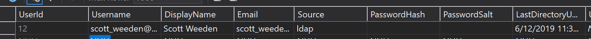

# OpenID for Serenity
Serenity is an application template for developing business apps in Visual Studio. 
The default application template stores user accounts and passwords in a database. 
For business users that require enterprise SSO, __Serenity.OpenID__ enables OpenID
support for the most widely used identity providers with no schema schanges necessary.

*See list below for AspNetCore and AspNetMvc support.*

*If your provider is not supported, use the Microsoft option and modify the web.config settings 
and OpenIdService.cs files to work with your provider and web platform*


## Getting Started
 
1. Add the Visual Studio OpenID Extension  
__Extensions -> Manage Extensions -> Online -> Serenity.OpenID__

2. Right click on the web project __Enable OpenID__
  

3. Select the provider you want to enable. 
You will need to obtain a client id and client secret from your provider below. If your provider
is not listed, select Microsoft.  You may need to edit the *OpenIdService.cs* file later.
   
    | Provider |  Developer Account | Obtain Client ID/Secret   | MVC  |  AspNetCore 
    |--|--|--|
    | Microsoft | [Azure Signup] | [Azure Portal] | [Azure MVC] | [Azure DotNetCore]|
    | Amazon | [AWS Signup] | [AWS Management] | ? | [AWS DotNetCore] |
    | Okta | [Okta Signup] | [Okta Management] |[Okta MVC] | [Okta AspNetCore] | 
    | Auth0 | [Auth0 Signup] | [Auth0 Management] | [Auth0 MVC] | [Auth0 AspNetCore] |
    | Google | [Google Signup] | [Google Management] | ? | ?  |
    |--|--|--|
    | All Others  | __[OpenID Certified Providers]__||

4.  Update  __web.config__ with your client secret and client id
    ```xml
    <configuration>
        <appSettings>
            <!--   OKTA EXAMPLE    -->
            <add key="OpenID" value="{ 
                Domain: 'https://{org-id}.okta.com',  
                ClientId : '<client-id>',  
                ClientSecret: '<client-secret here>',  
                RedirectUri: 'https://localhost:8080/',  
                PostLogoutUri:  'https://localhost:8080/Account/SignOut' }" />
            
            <!--   MICROSOFT EXAMPLE   -->
            <add key="OpenID" value="{ 
                Domain: 'https://https://login.microsoftonline.com/{tenant-id}',  
                ClientId : '<client-id>',  
                ClientSecret: '<client-secret>',  
                RedirectUri: 'https://localhost:8080/',  
                PostLogoutUri:  'https://localhost:8080/Account/SignOut' }" />
        
            <!--  AWS EXAMPLE   -->
            <add key="OpenID" value="{ 
                Domain: 'https://cognito-idp.{region name}.amazonaws.com/{pool id}',  
                ClientId : '{unique Cognito client ID}',  
                ClientSecret: '{key generated on Identity Pool creation}',  
                RedirectUri: 'https://localhost:8080/',  
                PostLogoutUri:  'https://localhost:8080/Account/SignOut' }" />
        
        </appSettings>
    ```

5.  You're ready to go! New users will be added to the database with no password/salt/hash after they're authenticated. Existing users will continue to see account/password login screen until the database is updated with the following:
     
    ```sql
    UPDATE USERS 
    SET PASSWORDHASH='', PASSWORDSALT='', SOURCE='ldap'
    WHERE LEN(PASSWORDHASH) >0
    ```

## Trouble Shooting
If you weren't so lucky the first time, you may need to update the OpenIdService.cs file with the appropriate claims. Set a breakpoint at Administration\Users\Authentication\OpenIdServices.cs

[Github Signup]:https://console.developers.google.com/apis/credentials/oauthclien
[Github Management]:https://console.developers.google.com/apis/credentials/oauthclien

[LinkedIn Signup]:https://console.developers.google.com/apis/credentials/oauthclien
[LinkedIn Management]:https://console.developers.google.com/apis/credentials/oauthclien

[Google Signup]:https://console.cloud.google.com/freetrial
[Google Management]:https://console.developers.google.com/apis/api/iam.googleapis.com
[Identity Platform]:https://cloud.google.com/identity-platform/

[Auth0 Signup]:https://auth0.com/signup
[Auth0 Management]:https://console.developers.google.com/apis/api/iam.googleapis.com
[Auth0 MVC]:https://auth0.com/docs/quickstart/webapp/aspnet-owin
[Auth0 AspNetCore]:https://auth0.com/docs/quickstart/webapp/aspnet-core/01-login

[Visual Studio Market Place]: https://marketplace.visualstudio.com/_apis/public/gallery/publishers/VolkanCeylan/vsextensions/SereneSerenityApplicationTemplate/3.9.6.1/vspackage
[Okta Signup]: https://developer.okta.com/signup/
[Okta Management]: https://www.oktapreview.com/
[Okta MVC]:https://developer.okta.com/blog/2018/04/18/authorization-in-your-aspnet-mvc-4-application
[Okta AspNetCore]:https://developer.okta.com/quickstart-fragments/dotnet/aspnetcore-implicit/

[Azure Signup]: https://azure.microsoft.com/en-us/free/
[Azure Portal]:https://portal.azure.com/#blade/Microsoft_AAD_RegisteredApps/ApplicationsListBlade
[Azure DotNetCore]:https://azure.microsoft.com/en-us/resources/samples/active-directory-dotnet-webapp-openidconnect-aspnetcore/
[Azure Mvc]:https://docs.microsoft.com/en-us/azure/active-directory/develop/tutorial-v2-asp-webapp


[OpenID Certified Providers]:https://openid.net/certification/

[AWS Signup]: https://portal.aws.amazon.com/billing/signup
[AWS Management]: https://portal.azure.com/#blade/Microsoft_AAD_RegisteredApps/ApplicationsListBlade
[AWS DotNetCore]: https://aws.amazon.com/blogs/developer/introducing-the-asp-net-core-identity-provider-preview-for-amazon-cognito/